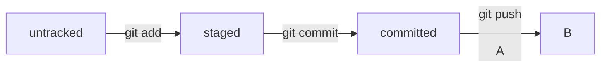

# Заголовок 1

## Заголовок 2

### Заголовок 3

#### Заголовок 4

##### Заголовок 5

**жирный**

_курсив_

`команда`

```bash
echo "Hello, World!"
```

- пункт 1
- пункт 2
- пункт 3


> цитата

[Ссылка](https://example.com)

## Mermaid



